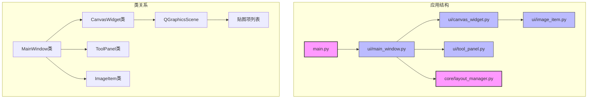
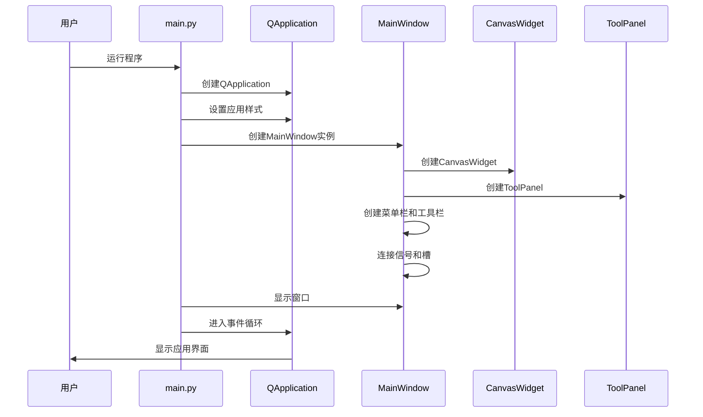
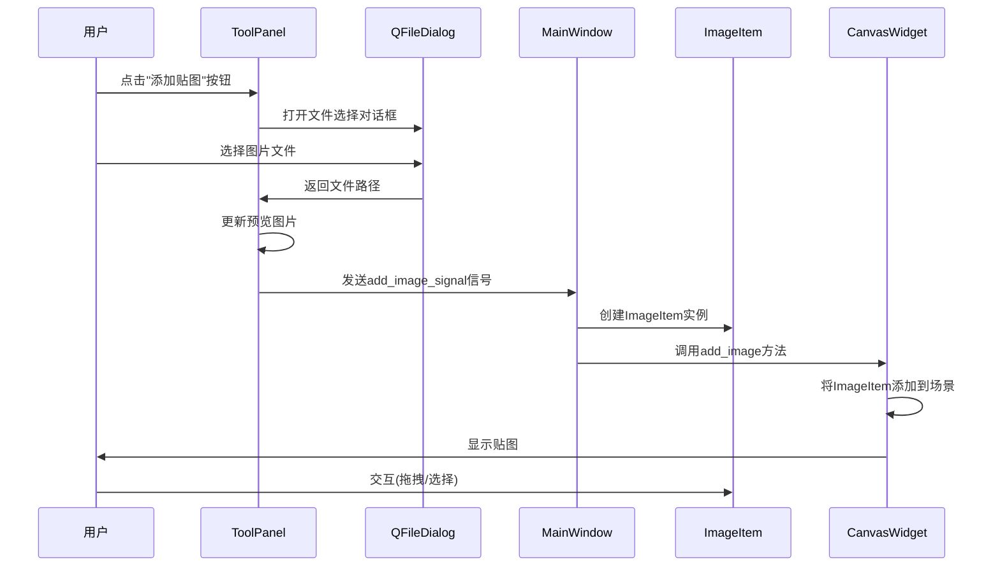
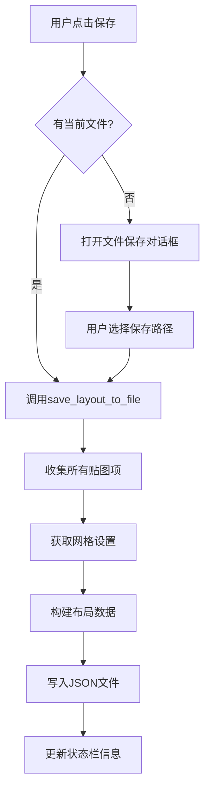
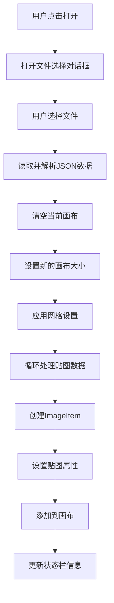
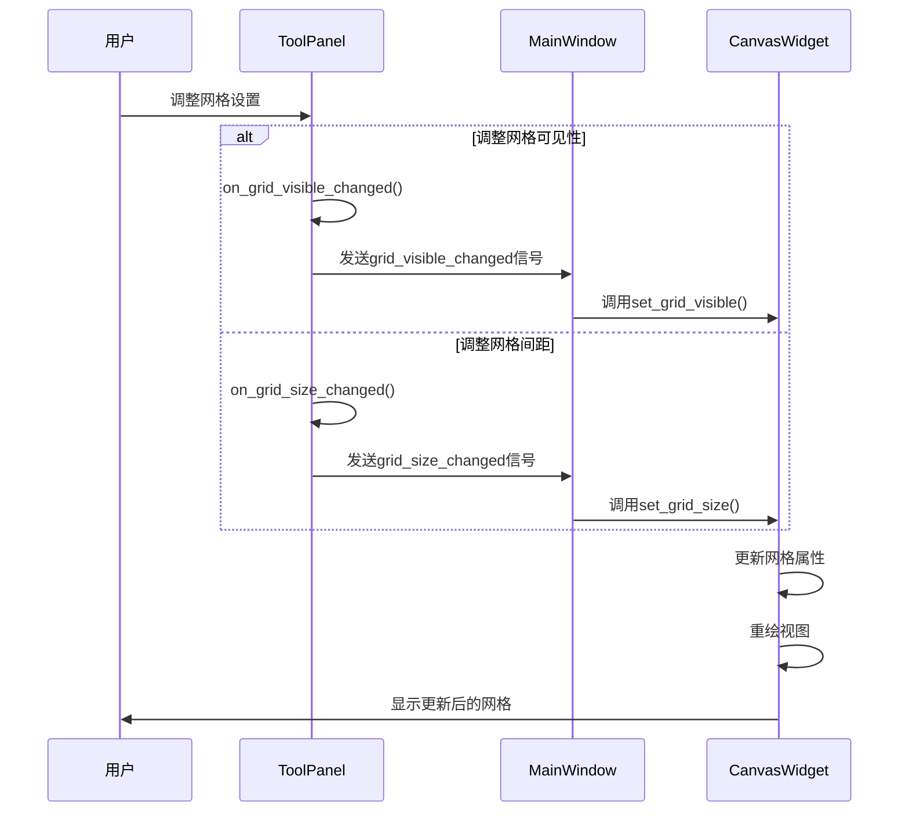
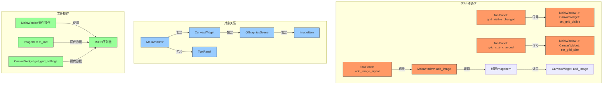

# 贴图可视化布局工具 - 开发日志

## 1. 项目概述

**贴图可视化布局工具**是一个用于可视化调整贴图布局并生成合并数据的应用程序。它允许用户通过图形界面添加、移动、缩放和管理多个贴图，并将布局数据导出为JSON格式供其他工具使用。

该工具使用PyQt5构建用户界面，主要分为左侧画布区域和右侧工具面板区域。左侧画布用于可视化显示和编辑贴图，右侧面板用于添加贴图和调整属性。

## 2. 项目结构

```
VisualizationTexLayout/
├── main.py                  # 主程序入口
├── requirements.txt         # 依赖库列表
├── README.md                # 项目说明
├── DEV_LOG.md               # 开发日志(本文件)
├── ui/                      # UI组件包
│   ├── __init__.py          # 包初始化文件
│   ├── main_window.py       # 主窗口类
│   ├── canvas_widget.py     # 画布组件
│   ├── tool_panel.py        # 工具面板
│   └── image_item.py        # 贴图项类
├── core/                    # 核心功能包
│   ├── __init__.py          # 包初始化文件
│   └── layout_manager.py    # 布局管理器
└── resources/               # 资源目录
    └── icons/               # 图标资源
```

## 3. 文件功能说明

### 3.1 主程序文件

#### `main.py`

- **功能**: 应用程序的入口点，初始化Qt应用并启动主窗口
- **主要函数**:
  - `main()`: 创建QApplication实例，设置应用样式，创建主窗口并显示
- **调用**: 实例化并显示 `MainWindow`

### 3.2 UI组件

#### `ui/main_window.py`

- **功能**: 定义主窗口类，整合画布和工具面板，并添加菜单栏、工具栏和状态栏
- **主要类**:
  - `MainWindow`: 继承自QMainWindow，是应用的主界面
- **主要方法**:
  - `init_ui()`: 初始化界面组件和布局
  - `create_menu_bar()`: 创建应用的菜单栏及菜单项
  - `create_tool_bar()`: 创建工具栏及其按钮
  - `connect_signals()`: 连接信号和槽
  - `add_image()`: 添加贴图到画布
  - `new_file()`, `open_file()`, `save_file()`, `save_file_as()`: 文件操作方法
  - `export_layout()`: 导出布局数据
- **调用关系**:
  - 创建和管理 `CanvasWidget` 和 `ToolPanel` 实例
  - 处理 `ToolPanel` 发出的添加贴图信号
  - 创建 `ImageItem` 并添加到 `CanvasWidget`

#### `ui/canvas_widget.py`

- **功能**: 定义画布组件，用于显示和编辑贴图
- **主要类**:
  - `CanvasWidget`: 继承自QGraphicsView，管理QGraphicsScene
- **主要方法**:
  - `drawBackground()`: 绘制背景和网格
  - `wheelEvent()`: 处理鼠标滚轮事件，实现缩放功能
  - `resizeEvent()`: 处理窗口大小改变事件
  - `reset_view()`, `fit_in_view()`: 视图控制方法
  - `add_image()`: 添加贴图项到场景
  - `clear_scene()`: 清空场景
  - `set_grid_visible()`, `set_grid_size()`: 设置网格属性
- **调用关系**:
  - 由 `MainWindow` 创建和管理
  - 接收并显示 `ImageItem` 对象

#### `ui/tool_panel.py`

- **功能**: 定义工具面板，包含添加贴图和属性编辑功能
- **主要类**:
  - `ToolPanel`: 继承自QWidget，是右侧工具面板
- **主要方法**:
  - `init_ui()`: 初始化界面组件和布局
  - `init_add_image_tab()`: 初始化添加贴图标签页
  - `init_property_tab()`: 初始化属性编辑标签页
  - `init_layer_tab()`: 初始化层级管理标签页
  - `init_view_settings_tab()`: 初始化视图设置标签页
  - `on_add_image_clicked()`: 处理添加贴图按钮点击事件
  - `on_grid_visible_changed()`, `on_grid_size_changed()`: 处理网格设置变更
  - `update_property_values()`: 更新属性编辑面板的值
  - `update_layer_list()`: 更新层级列表
- **调用关系**:
  - 由 `MainWindow` 创建和管理
  - 发出 `add_image_signal`、`grid_visible_changed` 和 `grid_size_changed` 信号，由 `MainWindow` 处理

#### `ui/image_item.py`

- **功能**: 定义贴图项类，管理单个贴图的状态和行为
- **主要类**:
  - `ImageItem`: 继承自QGraphicsItem，表示单个贴图
- **主要方法**:
  - `boundingRect()`: 返回贴图项的边界矩形
  - `paint()`: 绘制贴图项
  - `mousePressEvent()`, `mouseMoveEvent()`, `mouseReleaseEvent()`: 处理鼠标事件
  - `resize()`, `set_scale()`: 调整贴图大小和缩放
  - `to_dict()`: 将贴图项转换为字典，用于序列化
- **调用关系**:
  - 由 `MainWindow` 创建
  - 添加到 `CanvasWidget` 的场景中显示

### 3.3 核心功能

#### `core/layout_manager.py`

- **功能**: 定义布局管理器，负责保存、加载和导出布局数据
- **主要类**:
  - `LayoutManager`: 继承自QObject，管理布局数据
- **主要方法**:
  - `new_layout()`: 创建新的布局数据
  - `load_layout()`: 从文件加载布局数据
  - `save_layout()`: 将布局数据保存到文件
  - `export_layout()`: 导出布局数据
- **调用关系**:
  - 由 `MainWindow` 使用
  - 发出 `layout_loaded` 和 `layout_saved` 信号

## 4. 执行流程

### 4.1 应用启动流程

1. 用户运行 `main.py`
2. `main.py` 创建 QApplication 实例，设置应用样式
3. `main.py` 创建 `MainWindow` 实例
4. `MainWindow` 初始化界面:
   - 创建 `CanvasWidget` 实例 (左侧画布)
   - 创建 `ToolPanel` 实例 (右侧面板)
   - 创建菜单栏、工具栏和状态栏
   - 连接信号和槽
5. `MainWindow` 显示窗口
6. 应用进入事件循环

### 4.2 添加贴图流程

1. 用户点击右侧面板的"添加贴图"按钮
2. `ToolPanel.on_add_image_clicked()` 打开文件选择对话框
3. 用户选择图片文件
4. `ToolPanel` 更新预览图片并发出 `add_image_signal` 信号
5. `MainWindow.add_image()` 接收信号，创建 `ImageItem` 实例
6. `MainWindow` 将 `ImageItem` 添加到 `CanvasWidget` 的场景中
7. `CanvasWidget` 显示贴图
8. 用户可以拖拽和选择贴图

### 4.3 保存布局流程

1. 用户点击"保存"菜单项或工具栏按钮
2. `MainWindow.save_file()` 或 `MainWindow.save_file_as()` 被调用
3. 如果是首次保存或"另存为"，弹出文件保存对话框
4. 用户选择保存路径
5. `MainWindow.save_layout_to_file()` 收集所有贴图项的数据和网格设置
6. 将所有贴图项转换为字典格式，构建布局数据
7. 将布局数据保存为JSON文件
8. 更新状态栏显示保存成功信息

### 4.4 加载布局流程

1. 用户点击"打开"菜单项或工具栏按钮
2. `MainWindow.open_file()` 打开文件选择对话框
3. 用户选择布局文件
4. `MainWindow` 读取并解析布局数据
5. `MainWindow` 清空当前画布并设置新的画布大小和网格设置
6. 对于布局数据中的每个贴图:
   - 调用 `MainWindow.add_image()` 创建 `ImageItem`
   - 设置贴图的位置、缩放、旋转等属性
7. 更新状态栏显示加载成功信息

### 4.5 网格设置流程

1. 用户在右侧"视图设置"面板调整网格设置
2. `ToolPanel` 发出 `grid_visible_changed` 或 `grid_size_changed` 信号
3. `MainWindow` 通过连接的槽函数将设置转发给 `CanvasWidget`
4. `CanvasWidget` 更新网格属性并重绘视图
5. 用户看到实时更新的网格效果

## 5. 代码调用流程图

### 5.1 应用架构图



### 5.2 应用启动流程图



### 5.3 添加贴图流程图



### 5.4 保存布局流程图



### 5.5 加载布局流程图



### 5.6 网格设置流程图



### 5.7 组件交互关系图



## 6. 开发思路

### 6.1 架构设计

- **MVC分离**: 尽管没有严格遵循MVC模式，但项目结构将UI组件与核心功能分离
  - `ui` 包中的类负责界面显示和用户交互
  - `core` 包中的类负责数据处理和业务逻辑
  
- **信号-槽机制**: 使用Qt的信号-槽机制实现组件间的松耦合通信
  - `ToolPanel` 发出添加贴图信号和网格设置信号
  - `MainWindow` 接收信号并处理或转发
  - `LayoutManager` 发出布局加载/保存完成信号

- **组件化设计**: 将不同功能封装为独立的组件，便于维护和扩展
  - `CanvasWidget`: 负责画布显示和交互
  - `ToolPanel`: 负责工具面板功能
  - `ImageItem`: 负责贴图项表现和行为
  - `LayoutManager`: 负责布局数据处理

### 6.2 技术选择

- **PyQt5**: 选择PyQt5作为GUI框架，因为它功能强大且跨平台
  - 使用QGraphicsView和QGraphicsScene实现画布功能
  - 使用QSplitter分割左右区域
  - 使用QTabWidget实现工具面板的多页面切换

- **JSON格式**: 选择JSON作为布局数据的存储格式，因为它易读易写，且便于其他工具使用

### 6.3 扩展性考虑

- **插件系统**: 虽然第一阶段未实现，但架构设计上考虑了后期可能添加插件系统
- **自定义事件**: 设计了自定义信号，为后期添加更复杂的交互功能做准备
- **主题支持**: 使用Qt的样式机制，为后期添加主题切换功能做准备

### 6.4 贴图缩放与网格吸附的实现要点

- 通过在`ImageItem`类中实现四角缩放手柄，支持鼠标拖拽手柄进行缩放
- 缩放时宽高会自动吸附到网格（宽高为网格整数倍），保证贴图对齐
- 手柄仅在选中贴图时显示，交互直观
- 兼容原有的拖拽移动与吸附逻辑
- 缩放手柄的颜色和大小可在"视图设置"中单独分组自定义，所有贴图实时响应

## 7. 未来计划

根据项目规划文档，后续开发计划分为以下几个阶段：

### 第二阶段：贴图操作功能

- [x] 添加网格背景，支持在右侧面板设置网格间距
- [x] 添加画布边界显示和大小设置功能
- [x] 修改网格间距设置为百分比单位
- [x] 完善拖拽移动功能，添加网格吸附
- [ ] 实现画布平移功能，支持鼠标中键拖动（已知bug：指针样式已实现，但拖动功能未生效）
- [ ] 实现更精确的缩放功能，包括保持纵横比
- [ ] 完善层级调整功能，实现前移/后移/置顶/置底

### 第三阶段：数据导出和高级功能

- [ ] 完善配置导出功能，增加更多格式支持
- [ ] 实现对齐和分布功能
- [ ] 实现撤销/重做功能
- [ ] 增加快捷键支持

### 第四阶段：优化和完善

- [ ] 优化用户界面和交互体验
- [ ] 完善错误处理和异常情况
- [ ] 添加帮助文档和用户指南
- [ ] 性能优化

## 8. 开发过程中的疑难问题及解决方案

### 8.1 贴图拖拽实现

**问题**: 实现贴图拖拽功能，既要支持选中移动，又要支持多选操作

**解决方案**: 
- 使用QGraphicsItem的ItemIsMovable和ItemIsSelectable标志
- 重写mousePressEvent、mouseMoveEvent和mouseReleaseEvent方法
- 使用dragging标志跟踪拖拽状态

### 8.2 视图缩放控制

**问题**: 实现画布的缩放功能，既要支持鼠标滚轮缩放，又要支持适应视图

**解决方案**:
- 重写wheelEvent方法处理鼠标滚轮事件
- 实现scale方法控制缩放比例
- 添加reset_view和fit_in_view方法重置视图

### 8.3 布局数据序列化

**问题**: 将贴图项的位置、大小、缩放等属性保存为JSON格式

**解决方案**:
- 在ImageItem类中实现to_dict方法，返回所有属性的字典表示
- 在MainWindow中收集所有贴图项的字典表示，构建布局数据
- 使用json.dump将布局数据写入文件

### 8.4 网格绘制实现

**问题**: 实现可调整间距的网格背景，并保持在视图变换(缩放、平移)时的正确显示

**解决方案**:
- 重写QGraphicsView的drawBackground方法来绘制网格
- 使用视图到场景的变换矩阵计算网格线的位置
- 通过QSettings保存和恢复网格设置
- 实现信号-槽机制，使右侧面板的设置实时应用到网格显示

### 8.5 网格绘制浮点数精度问题

**问题**: 网格绘制过程中出现类型错误，在使用range()函数时试图将浮点数grid_size作为步长参数，导致TypeError异常

**解决方案**:
- 替换range()函数为while循环，以支持浮点型的grid_size
- 使用math.floor()函数正确计算网格起始位置，以支持非整数网格间距
- 通过增量方式绘制网格线，确保即使是小数值的网格间距也能正确显示
- 增加对画布变换的支持，保证在任何缩放比例下网格都能保持正确的间距

### 8.6 网格间距和画布尺寸优化

**问题**: 需要使网格间距更直观，并清晰显示画布边界

**解决方案**:
- 将网格间距单位从像素改为百分比，使其相对于画布宽度动态调整
- 添加红色边框显示画布边界，确保用户清楚了解工作区域
- 实现网格大小的动态计算，适应画布尺寸变化
- 添加最小/最大网格间距限制，确保网格在各种画布尺寸下都清晰可见

### v0.2.2
- 添加画布红色边界显示功能
- 将网格间距设置从像素单位改为百分比单位
- 优化网格缩放逻辑，根据画布大小自动调整
- 改进UI细节，提高用户体验

### v0.2.3
- 优化网格线绘制算法，确保网格线与画布边界精确对齐
- 改进网格线分布逻辑，保证均匀分布且在边界处重合
- 修复了设置特定百分比（如20%）时，网格线显示不均匀的问题

### v0.2.4
- 修复网格线数量计算逻辑，确保特殊百分比值下网格线数量正确
- 对25%和50%等常用百分比值进行特殊处理，确保网格线精确放置
- 改进通用百分比计算公式，使网格线总是按预期均匀分布

### v0.2.5 
- 简化网格间距设置，将自由输入改为固定选项（10%、20%、25%、50%）
- 优化用户界面，减少用户误操作的可能性
- 确保网格显示与预设百分比值完全匹配

### v0.2.6
- 新增贴图四角缩放手柄，选中贴图后可通过四角手柄拖拽缩放
- 实现缩放时宽高自动吸附到网格，提升布局精度
- 保持原有移动与吸附功能不变，交互体验更直观

### v0.2.7
- "缩放手柄设置"单独成组，支持自定义手柄颜色和大小，所有贴图项实时响应设置

### v0.2.8
- 修复打开json文件时画布宽高为float导致的类型报错，现已自动转换为int
- 优化缩放手柄拖动逻辑，锚点始终为对角且跟随鼠标，所有角缩放体验完全符合直觉

### v0.2.9
- 新增鼠标中键拖动画布功能，支持按住中键拖动来平移整个画布视图
- 优化拖拽体验，添加手型指针反馈
- 修复拖拽模式冲突，确保与其他功能（如贴图拖拽）互不干扰

### v0.2.10
- 修复鼠标中键拖动画布功能的部分问题，成功实现鼠标指针样式变化
- 已知问题：鼠标中键拖动画布功能尚未完全实现，需要进一步修复

### v0.2.11
- 将贴图位置信息从像素改为百分比格式，使布局数据更具通用性
- 优化位置计算逻辑，支持不同画布尺寸下的位置保持
- 改进布局数据的可移植性

### 8.8 位置信息百分比化

**问题**: 需要将贴图位置信息从像素改为百分比格式，以提高布局数据的通用性和可移植性

**解决方案**:
- 修改 ImageItem 的 to_dict 方法，将位置信息转换为百分比
- 在加载布局数据时，将百分比位置转换回像素坐标
- 添加场景大小检查，确保位置计算正确
- 优化错误处理，提供默认值防止异常

## 9. 版本历史

### v0.1.0
- 初始版本
- 实现基本界面结构
- 实现添加贴图、拖拽移动功能
- 实现文件保存/加载功能

### v0.2.0
- 添加网格背景功能
- 支持在右侧面板设置网格间距
- 支持网格显示开关
- 保存和加载网格设置

### v0.2.1
- 修复网格绘制时的浮点数精度问题
- 优化网格绘制算法，支持任意精度的网格间距设置
- 改进网格起始位置计算，确保网格线对齐

### v0.2.2
- 添加画布红色边界显示功能
- 将网格间距设置从像素单位改为百分比单位
- 优化网格缩放逻辑，根据画布大小自动调整
- 改进UI细节，提高用户体验

### v0.2.3
- 优化网格线绘制算法，确保网格线与画布边界精确对齐
- 改进网格线分布逻辑，保证均匀分布且在边界处重合
- 修复了设置特定百分比（如20%）时，网格线显示不均匀的问题

### v0.2.4
- 修复网格线数量计算逻辑，确保特殊百分比值下网格线数量正确
- 对25%和50%等常用百分比值进行特殊处理，确保网格线精确放置
- 改进通用百分比计算公式，使网格线总是按预期均匀分布

### v0.2.5 
- 简化网格间距设置，将自由输入改为固定选项（10%、20%、25%、50%）
- 优化用户界面，减少用户误操作的可能性
- 确保网格显示与预设百分比值完全匹配

### v0.2.6
- 新增贴图四角缩放手柄，选中贴图后可通过四角手柄拖拽缩放
- 实现缩放时宽高自动吸附到网格，提升布局精度
- 保持原有移动与吸附功能不变，交互体验更直观

### v0.2.7
- "缩放手柄设置"单独成组，支持自定义手柄颜色和大小，所有贴图项实时响应设置

### v0.2.8
- 修复打开json文件时画布宽高为float导致的类型报错，现已自动转换为int
- 优化缩放手柄拖动逻辑，锚点始终为对角且跟随鼠标，所有角缩放体验完全符合直觉

### v0.2.9
- 新增鼠标中键拖动画布功能，支持按住中键拖动来平移整个画布视图
- 优化拖拽体验，添加手型指针反馈
- 修复拖拽模式冲突，确保与其他功能（如贴图拖拽）互不干扰

### v0.2.10
- 修复鼠标中键拖动画布功能的部分问题，成功实现鼠标指针样式变化
- 已知问题：鼠标中键拖动画布功能尚未完全实现，需要进一步修复

### v0.2.11
- 将贴图位置信息从像素改为百分比格式，使布局数据更具通用性
- 优化位置计算逻辑，支持不同画布尺寸下的位置保持
- 改进布局数据的可移植性

---

**注**：本开发日志会随着项目进展不断更新，记录最新的开发思路和决策。